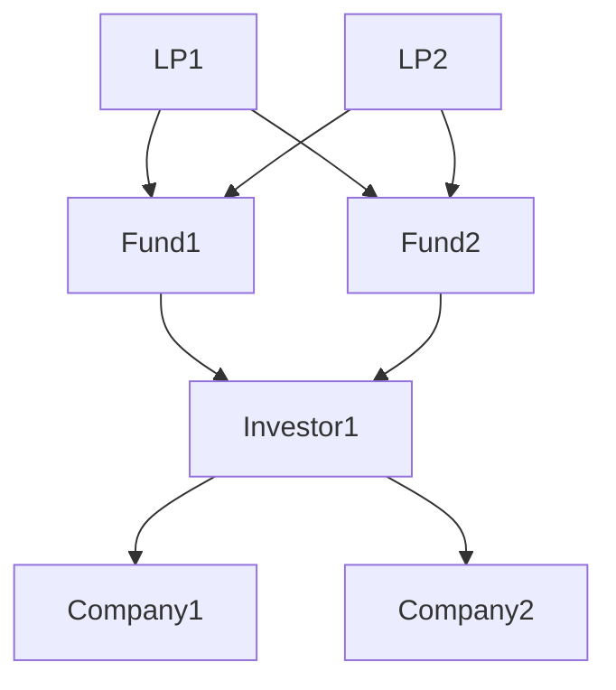

# 1. Introduction 

code of HetGNN in KDD2019 paper: Heterogeneous Graph Neural Network 

# 2. How to use

python HetGNN.py [parameters]

(enable GPU: python HetGNN.py --cuda 1)

#test data used in academic_test folder (academic-2 data used in this paper, T_s = 2012): (author) A_n - 28646, (paper) P_n - 21044, (venue) V_n - 18

test data link: https://drive.google.com/file/d/1N6GWsniacaT-L0GPXpi1D3gM2LVOih-A/view?usp=sharing

# 3. Data requirement

**1. 节点文件**

- 第一类

  a_p_list_train.txt: paper neighbor list of each author in training data

  p_a_list_train.txt: author neighbor list of each paper in training data

- 第二类

  p_p_citation_list.txt: paper citation neighbor list of each paper 

- 第三类

  v_p_list_train.txt: paper neighbor list of each venue in training data

  p_v.txt: venue of each paper

**2. Embedding文件**

- p_title_embed.txt: pre-trained paper title embedding

- p_abstract_embed.txt: pre-trained paper abstract embedding

- node_net_embedding.txt: pre-trained node embedding by network embedding

**3. Sampled文件**

- het_neigh_train.txt: generated neighbor set of each node by random walk with re-start 

- het_random_walk.txt: generated random walks as node sequences (corpus) for model training

**run the program**

python HetGNN.py [parameters]

(enable GPU: python HetGNN.py --cuda 1)

## 总结：

我们有四类节点，分别是company、LP、Investor、Fund。暂时无同类型节点之间的连边。

| 节点类型 | 简称 | 联系     |          |
| -------- | ---- | -------- | -------- |
| Company  | C    | Investor |          |
| LP       | LP   | Fund     |          |
| Investor | IN   | Fund     | Company  |
| Fund     | F    | LP       | Investor |

# 4. Model evaluation for different applications

**Node classification/clustering (author classification/clustering)**

step-1: run [author classification/clustering] part in application.py to obtain evalution result 

#  Others

- 5-1 raw_data_process.py: raw data (academic_small.txt) processing and data preparation

- 5-2 input_data_process.py: generating het_rand_walk for model training, train/test data for different tasks, etc. 

- 5-3 DeepWalk.py: generating pre-train node embedding 

- 5-4 If you find code useful, please consider citing our work.

Heterogeneous Graph Neural Network

Zhang, Chuxu and Song, Dongjin and Huang, Chao and Swami, Ananthram and Chawla, Nitesh V.

Proceedings of the 25th ACM SIGKDD International Conference on Knowledge Discovery & Data Mining, KDD '19

For more information, contact: Chuxu Zhang (chuxuzhang@gmail.com)

